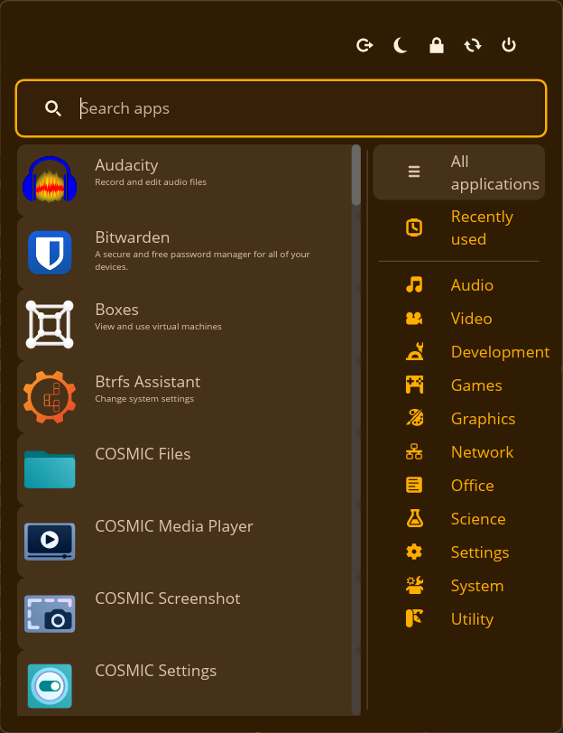

# COSMIC Classic Menu

Cosmic Classic Menu is a customizable application launcher for the Cosmic desktop environment. It provides a classic-style menu for launching applications, accessing system tools, and managing power options.



## Features

- Classic-style application menu
- Search functionality with fuzzy matching and typo tolerance
- Categorized application list
- Recently used applications
- Power options (shutdown, restart, logout, etc.)
- System tools (settings, system monitor, disk management)

## Installation

To install COSMIC Classic Menu, follow these steps:

1. Clone the repository:
    ```sh
    git clone https://github.com/championpeak87/cosmic-classic-menu.git
    cd cosmic-classic-menu
    ```

2. Build the project using Cargo:
    ```sh
    cargo build --release
    ```

3. Install the application:
    ```sh
    cargo install --path .
    ```

## Usage

To launch the COSMIC Classic Menu, run the following command:
```sh
cosmic-classic-menu

## Configuration

The configuration file is located at ~/.config/cosmic/cosmic-classic-menu/v1. You can customize various settings such as the position of the application list, power options, and search field.

## Development
To contribute to the development of Cosmic Classic Menu, follow these steps:

Fork the repository and clone your fork:
```sh
git clone https://github.com/your-username/cosmic-classic-menu.git
cd cosmic-classic-menu
```

Create a new branch for your feature or bugfix:
```sh
git checkout -b my-feature-branch
```

Make your changes and commit them:
```sh
git commit -am "feat: add new feature"
```

Push your changes to your fork:
```sh
git push origin my-feature-branch
```

Create a pull request on GitHub.

## License
This project is licensed under the GPL License. See the LICENSE file for details.

## Acknowledgements
- Cosmic Desktop Environment
- fuzzy-matcher
- freedesktop-desktop-entry