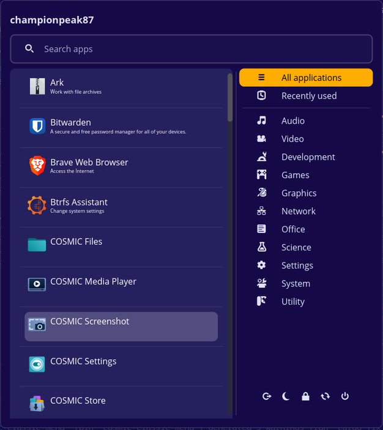

# cosmic-ext-classic-menu

COSMIC™ Classic Menu is a customizable application launcher for the COSMIC™ desktop environment. It provides a classic style menu for launching applications, accessing system tools, and managing power options.



## Features

- Classic-style application menu
- Search functionality with fuzzy matching and typo tolerance
- Categorized application list
- Recently used applications
- Power options (shutdown, restart, logout, etc.)
- System tools (settings, system monitor, disk management)

## ToDo

- Right click menu for applications
- Favorites applications
- Browsing app list with arrow keys

## Installation 

Clone the repository:

```bash
git clone https://github.com/championpeak87/cosmic-ext-classic-menu cosmic-ext-classic-menu
cd cosmic-ext-classic-menu
```

Build and install the project:

```bash
just build-release
sudo just install
```

## Flatpak

This project includes a Flatpak manifest at `flatpak/com.championpeak87.cosmic-ext-classic-menu.json` and a `cargo-sources.json` helper. Use Flatpak and flatpak-builder to build, install, and run the app locally.

Prerequisites

- flatpak
- flatpak-builder
- Access to the runtimes referenced by the manifest (for example Flathub and/or System76's Flatpak remotes). If a runtime isn't available you may need to enable Flathub or add the appropriate remote.

Build and install (user)

From the repository root:

```bash
# build and install into the current user
flatpak-builder --install --user --force-clean build-dir flatpak/com.championpeak87.cosmic-ext-classic-menu.json
```

Run without installing

```bash
# build the project and run the app inside the build sandbox
flatpak-builder --run build-dir flatpak/com.championpeak87.cosmic-ext-classic-menu.json com.championpeak87.cosmic-ext-classic-menu
```

Create a reusable bundle and install

```bash
# create a local flatpak repo and build the app into it
flatpak-builder --repo=repo build-dir flatpak/com.championpeak87.cosmic-ext-classic-menu.json --force-clean

# create a single-file bundle (stable branch)
flatpak build-bundle repo com.championpeak87.cosmic-ext-classic-menu.flatpak com.championpeak87.cosmic-ext-classic-menu stable

# install the bundle for the current user
flatpak install --user com.championpeak87.cosmic-ext-classic-menu.flatpak
```

Notes & troubleshooting

- If the build fails due to a missing runtime, add Flathub (or the remote that provides the runtime):

```bash
flatpak remote-add --if-not-exists flathub https://flathub.org/repo/flathub.flatpakrepo
```

- The manifest uses `com.system76.Cosmic.BaseApp` as its base. Ensure that remote provides that runtime or change the manifest to a base available to you.


## Fedora / COPR

A Fedora COPR package is available for this project in the `championpeak87/cosmic-ext-classic-menu` COPR repository. Use the `dnf copr` helper to enable the COPR and install the packaged RPM.

```bash
# enable the COPR repository (requires sudo)
sudo dnf copr enable championpeak87/cosmic-ext-classic-menu -y

# install the packaged application
sudo dnf install cosmic-ext-classic-menu
```

To update the package later:

```bash
sudo dnf upgrade --refresh cosmic-ext-classic-menu
```

To remove the package and disable the COPR repo:

```bash
sudo dnf remove cosmic-ext-classic-menu
sudo dnf copr disable championpeak87/cosmic-ext-classic-menu
```

More details and package versions are available on the COPR page:

https://copr.fedorainfracloud.org/coprs/championpeak87/cosmic-ext-classic-menu/

## Contributing

A [justfile](./justfile) is included with common recipes used by other COSMIC projects:

- `just build-debug` compiles with debug profile
- `just run` builds and runs the application
- `just check` runs clippy on the project to check for linter warnings
- `just check-json` can be used by IDEs that support LSP

## License

Code is distributed with the [GPL-3.0-only license][./LICENSE]

